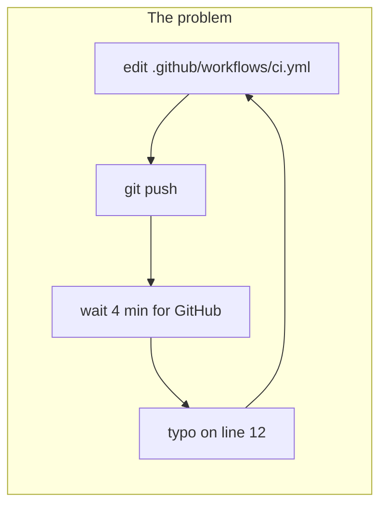
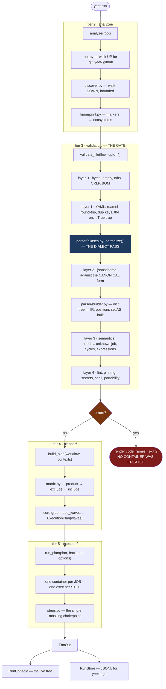
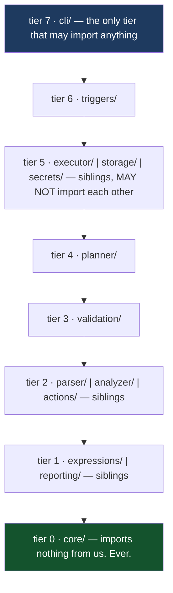
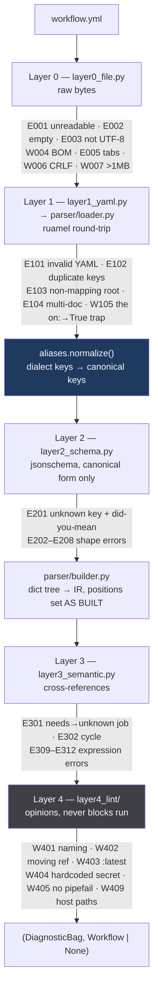
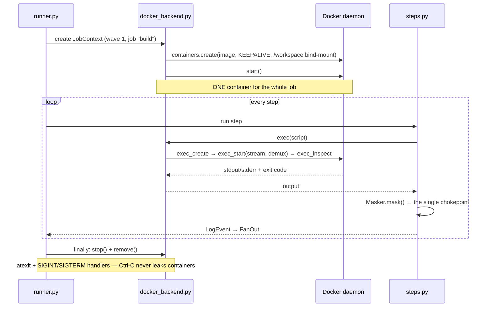
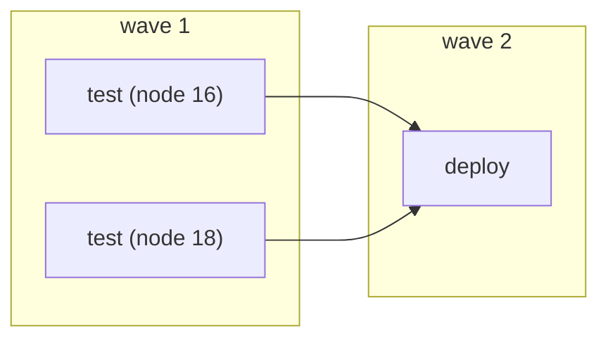
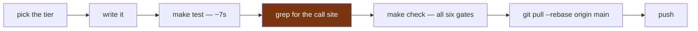

# Understanding yeet — start here if the code is new to you

The [handbook](handbook.md) tells you *how we work*. This document tells you
*what the thing is* and *how to hold it in your head*. Read this first if you
have never opened the codebase; read the handbook second.

Everything below was verified by running it, not copied from a design doc.

---

## 1. Getting it running (10 minutes)

```bash
git clone <repo> && cd GIST/yeet

python -m venv .venv
source .venv/bin/activate          # Windows: .venv\Scripts\Activate.ps1

pip install -e ".[dev]"
pre-commit install

make check                          # every gate CI runs — must be green
yeet --help
```

`make check` runs six gates: `lint · format · imports · types · noprint · test`.
Expect roughly **672 tests in ~7 seconds**, plus 18 Docker tests that are
deselected automatically when no daemon is running.

### Your first run, with no Docker at all

The fastest way to see the whole system work is `cooked_on: local`, which runs
steps in your own shell instead of a container:

```bash
mkdir -p /tmp/demo/.yeet/flows && cd /tmp/demo && git init -q .
cat > .yeet/flows/main.yml <<'EOF'
vibe: hello
when: {push: {}}
the_grind:
  build:
    cooked_on: local
    moves:
      - bet: echo "we are so back"
EOF

yeet scan      # what is this project?
yeet check     # is the workflow correct?
yeet graph     # what would run, in what order?
yeet run       # run it
yeet logs      # replay what just happened
```

That is the entire product surface in five commands. If those work, your
environment is fine.

### With Docker

```bash
make image      # builds yeet/ubuntu:22.04 — jobs with `cooked_on: ubuntu-latest` need it
make docker     # the 18 container tests
```

---

## 2. What yeet actually is



yeet collapses that loop onto your laptop. It reads GitHub Actions workflow
files, **tells you what is wrong with them before running anything**, and then
executes them locally in Docker.

Three ideas make it more than "act, but in Python":

| Idea | What it means |
|---|---|
| **Validation is a first-class product** | Five layers, rustc-style code frames pointing at the exact column. `yeet check` needs no Docker at all. |
| **The gate** | If the file has errors, **no container is ever created**. Exit 2. |
| **A dialect** | `vibe:`/`the_grind:`/`bet:` are a key-rewrite pass over one parser. Real `.github/workflows/*.yml` runs unchanged — a superset, not a replacement. |

---

## 3. The one diagram that explains the whole system

`yeet run` is the full pipeline. **Every other command is a prefix of it.**
Internalise this and the codebase stops being 101 files and becomes six stages.



### Commands as prefixes

```mermaid
flowchart LR
    subgraph S[" "]
        direction LR
        a["analyze"] --> b["validate"] --> c["plan"] --> d["execute"]
    end

    scan["yeet scan"] -.->|"upto=2"| b
    check["yeet check"] -.->|"upto=4"| b
    graph["yeet graph"] -.->|"upto=4 + plan"| c
    run["yeet run"] -.->|"everything"| d
```

Two seams worth memorising:

- **`validate_file` returns `(bag, workflow)`.** That tuple is why `run` can
  validate and then plan without parsing twice, and why `check`, `scan` and
  `graph` are each about thirty lines.
- **`upto=N` is what makes each command a prefix.** `scan` uses `upto=2`
  (fast, no semantics), `check` and `run` use `upto=4`; `run` blocks only on
  errors, never on warnings.

---

## 4. The one architectural rule

**Imports only ever point downhill.** Every directory has a tier. A module may
import from lower tiers, never from a higher tier and never from a sibling on
the same line. `lint-imports` enforces this on every push — it is not a
convention, it is a build gate.



### When the rule blocks you

**Push the pure part down into `core/`, and leave the policy up top.** That one
move solved all five conflicts this rule caused, and each indirection turned out
to be worth having anyway:

| The problem | The move |
|---|---|
| executor needs masking, `secrets/` is a sibling | `core/masking.py` — a pure `Masker` |
| executor needs to write logs, `storage/` is a sibling | `core/events.py` — `LogSink` protocol, inverted |
| the `scan` renderer needs `Project`, `analyzer/` is above it | `core/project.py` |
| layer 3 and the planner both need cycle detection | `core/graph.py` — plain `{node: [deps]}`, no IR |
| `actions/` "runs" steps but the executor consumes it | `actions/` resolves to IR, executes nothing; sits at tier 2 |

`core/` is **closed** — a sixth addition needs the whole team to agree.
`core/ir.py` and `core/diagnostics.py` are **frozen**: changing a field means a
standup, because the planner, executor and renderer all destructure them.

---

## 5. How validation works

This is the subsystem that makes yeet a product rather than a script.



Two rules govern the pipeline:

1. **Stop *between* layers, never *within* one.** A user who fixes one error per
   run will hate the tool. If three `needs:` are wrong, report all three.
2. **Layer 4 prints but never blocks.** Warnings are opinions. Only errors
   (layers 0–3) trigger the exit-2 gate.

Positions are set **as each IR node is built**, from `data.lc.value(key)` —
never retrofitted. Retrofitting is a parser rewrite. This is why a code frame
can point at the exact column of the offending key.

### What a diagnostic looks like

```
warning[YEET-W402]: Action `actions/checkout@main` is pinned to moving ref `@main`
 --> .yeet/flows/tok.yml:10:15
   |
 9 |       - name: pinning
10 |         uses: actions/checkout@main
   |               ^
   |
   = help: Pin to a commit SHA or a release tag
```

Every code has a section in [`rules.md`](rules.md) — **generated** from
`core/codes.py`, never hand-edited — and `yeet explain YEET-W402` prints it.

---

## 6. How execution works

The core insight, and the thing worth explaining in any review:
**one container per job, one `exec` per step.**



Why one container per job rather than per step: a step that runs
`npm install` must be visible to the step that runs `npm test`. Per-step
containers lose the filesystem between steps; per-job keeps it, which is
exactly GitHub's own semantics.

Two details that cost real debugging time and are worth knowing before you
touch `executor/`:

- **`exec_run(stream=True)` returns `exit_code=None`.** That is why
  `docker_backend.py` does the low-level `exec_create → exec_start → exec_inspect`
  dance by hand.
- **Step scripts are always written as `\n` bytes**, never CRLF. A `\r` in a
  script produces `$'\r': command not found`, which is bug #1 on the "will bite
  you" list.

### Job scheduling



`planner/matrix.py` expands the matrix in **GitHub's real order**: cartesian
product → `exclude` → `include`. `core.graph.topo_waves` then groups job
instances into waves; jobs inside a wave run in a bounded pool (`--jobs N`).
A job whose `needs` failed is **skipped**, unless its `if:` uses
`always()`/`failure()`.

---

## 7. Where the code lives

```
src/yeet/
├── core/            tier 0  ir.py (FROZEN) · diagnostics.py (FROZEN) · codes.py
│                            events.py · masking.py · graph.py · project.py · config.py
├── expressions/     tier 1  lexer → Pratt parser → evaluator. NEVER eval().
├── reporting/       tier 1  theme · render (code frames) · console · json_out · sarif
├── parser/          tier 2  loader (ruamel) · aliases (the dialect) · builder (→ IR) · schema/
├── analyzer/        tier 2  root · discover · markers · fingerprint · project
├── actions/         tier 2  resolver · composite — resolves uses:, executes NOTHING
├── validation/      tier 3  pipeline · layer0_file · layer1_yaml · layer2_schema
│                            layer3_semantic · layer4_lint/
├── planner/         tier 4  matrix · plan · graph
├── executor/        tier 5  runner · steps · docker_backend · local_backend · script
│                            env · state_files · commands · images · workspace · paths
├── storage/         tier 5  runs (JSONL) · artifacts · cache
├── secrets/         tier 5  store (Fernet + scrypt)
├── triggers/        tier 6  watcher (watchdog + debounce) · hooks
└── cli/             tier 7  app.py + one cmd_*.py per command
```

### Where does my change go?

| You are writing… | It goes in | Tier |
|---|---|---|
| a new diagnostic code | `core/codes.py` (append to **your layer's** block) | 0 |
| terminal output, colors, code frames | `reporting/` | 1 |
| anything about `${{ }}` | `expressions/` | 1 |
| "what is this project" | `analyzer/` | 2 |
| YAML → IR | `parser/` | 2 |
| resolving a `uses:` to steps | `actions/` (resolves only, never executes) | 2 |
| a new check on a workflow | `validation/layerN_*.py` or `layer4_lint/` | 3 |
| matrix, DAG, waves | `planner/` | 4 |
| anything touching Docker or a subprocess | `executor/` | 5 |
| a new command | a new `cli/cmd_*.py` + one line in `cli/app.py` | 7 |

---

## 8. A reading order for the codebase

Do not read alphabetically. Follow one workflow file through the machine — about
90 minutes and you will understand the whole thing.

| # | File | Why this one |
|---|---|---|
| 1 | `core/ir.py` | The vocabulary. `Workflow`, `Job`, `Step`. Everything else destructures these. |
| 2 | `core/diagnostics.py` | `Diagnostic`, `Position`, `Severity`, `DiagnosticBag`. The other half of the vocabulary. |
| 3 | `parser/aliases.yml` | The dialect, as a flat table. One line per alias. |
| 4 | `validation/pipeline.py` | The spine. Layers in order, the `(bag, workflow)` return. |
| 5 | `parser/builder.py` | dict → IR, and how positions are attached as nodes are built. |
| 6 | `validation/layer3_semantic.py` | What a real cross-reference check looks like. |
| 7 | `planner/plan.py` | Matrix → DAG → waves. |
| 8 | `executor/steps.py` | The per-step loop and the masking chokepoint. |
| 9 | `executor/docker_backend.py` | The container-per-job trick, and the exec-code trap. |
| 10 | `cli/cmd_run.py` | How all of the above is wired together. |

Every file carries `Owner:` and `Tier:` in its module docstring. The tier line
tells you what you are allowed to import; the owner line tells you who to ask.

---

## 9. How to make a change safely



**Step 4 is the one people skip, and it is the one that has cost this project
the most.** A unit test that imports the thing it tests can prove the thing
works and still miss that *nothing calls it*. The two worst bugs ever found in
this codebase were exactly that shape:

- `aliases.normalize()` had **no call site** — the dialect, the headline
  feature, failed its own validator, while its unit tests stayed green because
  they called `normalize()` by hand.
- The layer-4 lint rules self-registered on an import **nobody performed**, so
  `RULES` was empty in production and `yeet check` silently found nothing.

Both had passing unit tests throughout. **When you finish a module, grep for its
call site. If there isn't one, you are not done.**

### Conventions you will hit in the first hour

- **CLI options use `Annotated`** — `path: Annotated[Path, typer.Option("--path")] = Path()`.
  The classic style trips ruff's B008 on every parameter.
- **`Status` and `Severity` stay `(str, Enum)`**, not `StrEnum`, with a
  `# noqa: UP042`. StrEnum changes what `str()` returns, and three modules
  format those values.
- **Never `print()`.** Output is a `Diagnostic` or `typer.echo`/`secho`.
  `make noprint` fails the build on a bare `print(` under `src/`, checked by AST
  so it doesn't trip on the word inside a docstring.
- **Never `eval()`** for expressions. `expressions/` is a hand-rolled lexer and
  Pratt parser for exactly this reason.

---

## 10. Debugging

| Symptom | Do this |
|---|---|
| anything confusing | `make check` — most confusion is a gate you haven't run |
| a code fired and you don't know why | `yeet explain YEET-E301` |
| `YEET-E900` internal error | `YEET_DEBUG=1 yeet check <file>` — re-raises with a traceback |
| a rule "doesn't work" | check it has a call site, then check the layer above didn't stop first |
| Docker weirdness | `make image` first — jobs need `yeet/ubuntu:22.04` to exist |
| you don't know who owns a file | the `Owner:` line in its docstring |

Remember the between-layers rule when debugging validation: **if layer 3 emits
an error, layer 4 never runs.** A lint rule that "doesn't fire" is very often a
lint rule sitting behind an earlier error.

---

## 11. Exit codes — a contract, scripts depend on them

| Code | Meaning |
|---|---|
| 0 | slayed |
| 1 | the workflow ran and something in it failed |
| 2 | the workflow file is wrong — **nothing ran**. This is the gate. |
| 3 | no Docker daemon |

---

## 12. The dialect, in full

```yaml
vibe: hello                    # name:
when: {push: {}}               # on:
the_grind:                     # jobs:
  build:
    cooked_on: ubuntu-latest   # runs-on:
    moves:                     # steps:
      - bet: echo "we are so back"   # run:
```

`vibe`→name · `when`→on · `the_grind`/`missions`→jobs · `cooked_on`→runs-on ·
`moves`→steps · `bet`/`cook`→run · `yoink`/`borrow`→uses · `after`/`waits_for`→needs ·
`only_if`/`no_cap_if`→if · `drip`→env · `tea`→secrets · `squad`→strategy ·
`multiverse`→matrix · `patience`→timeout-minutes · `delulu`/`its_fine`→continue-on-error ·
`where`→working-directory

> **Note:** `loot`→artifacts and `stash`→cache were removed from the alias table
> in the same session `actions/upload-artifact` and `actions/cache` became
> reachable as ordinary `uses:` steps. Job-level `artifacts:`/`cache:` keys are
> not canonical GitHub Actions, so a dialect key for them would validate clean
> and then silently do nothing at runtime — the alias table's one rule is that
> the right-hand side is a canonical key. Use the actions instead.

Status vocabulary in output: **slayed** (success) · **flopped** (failure) ·
**mid** (partial) · **cooked** (running) · **skipped (not the vibe)**.

Both spellings produce byte-identical IR — `tests/unit/test_dialect_parity.py`
asserts exactly that, through the real entry point.

---

## 13. Where this sits relative to prior art

`nektos/act` is the well-known local GitHub Actions runner (Go, MIT). We studied
its architecture — the container-reuse-per-job trick is genuinely its core
insight, and [ADR 0002](adr/0002-why-python-and-not-go.md) records why we chose
Python anyway.

What yeet adds that act does not attempt:

| | act | yeet |
|---|---|---|
| runs workflows locally | ✅ | ✅ |
| validates before running, with code frames | ✗ | ✅ five layers, exit 2 gate |
| lint layer (hardcoded secrets, moving refs, portability) | ✗ | ✅ ~20 rules |
| `explain <CODE>` | ✗ | ✅ generated from the code registry |
| SARIF / JSON output for editors and CI | ✗ | ✅ |
| an alternate surface dialect over one parser | ✗ | ✅ |

The honest one-liner: **act is a runner; yeet is a validator that also runs.**
The gate — "the file is wrong, nothing ran, exit 2" — is the differentiator, and
it is the part that survives a projector demo when Docker does not.
